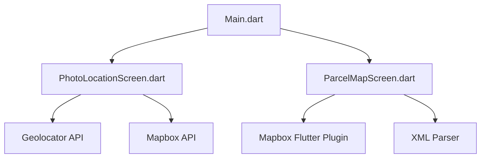

# t3aisat App

`T3AISat` es una aplicación desarrollada en Flutter para dispositivos Android e iOS que permite a los usuarios obtener su geolocalización, capturar fotos con anotaciones de geolocalización y visualizar mapas de parcelas utilizando Mapbox. Este documento proporciona una descripción técnica detallada del código, las funcionalidades de la aplicación, las dependencias utilizadas, y las configuraciones específicas para iOS y Android.

## Tabla de Contenidos

1. [Arquitectura del Proyecto](#arquitectura-del-proyecto)
2. [Descripción de Archivos y Funcionalidades](#descripción-de-archivos-y-funcionalidades)
   - [lib/main.dart](#libmaindart)
   - [lib/screens/photo_location_screen.dart](#libscreensphoto_location_screendart)
   - [lib/screens/parcel_map_screen.dart](#libscreensparcel_map_screendart)
   - [lib/model/environment.dart](#libmodelenvironmentdart)
3. [Dependencias](#dependencias)
4. [Configuración de iOS](#configuración-de-ios)
5. [Configuración de Android](#configuración-de-android)
6. [Instrucciones para Ejecutar la Aplicación](#instrucciones-para-ejecutar-la-aplicación)
7. [Buenas Prácticas](#buenas-prácticas)
8. [Consideraciones de Rendimiento y Seguridad](#consideraciones-de-rendimiento-y-seguridad)

## Arquitectura del Proyecto

La aplicación sigue un enfoque basado en widgets y se estructura de la siguiente manera:

- **lib/**: Carpeta principal que contiene el código fuente de la aplicación.
  - **main.dart**: Punto de entrada de la aplicación.
  - **screens/**: Carpeta que contiene las pantallas de la aplicación.
    - `photo_location_screen.dart`: Pantalla para capturar fotos y geolocalización, además de anotar la información en la imagen.
    - `parcel_map_screen.dart`: Pantalla para visualizar mapas de parcelas.
  - **model/**: Carpeta que contiene las definiciones de modelos.
    - `environment.dart`: Archivo para la configuración del entorno.

### Diagrama de Arquitectura

El siguiente diagrama muestra la arquitectura general de la aplicación y cómo interactúan los diferentes componentes:



La pantalla `PhotoLocationScreen` interactúa con las APIs de `Geolocator` y `Mapbox` para capturar la geolocalización del usuario, anotar esta información junto con la fecha y hora en la foto, y luego guardar la imagen en la galería del dispositivo. La pantalla `ParcelMapScreen` utiliza el plugin de `Mapbox` para mostrar un mapa interactivo que permite a los usuarios visualizar parcelas catastrales.

## Descripción de Archivos y Funcionalidades

### lib/main.dart

Este archivo es el punto de entrada de la aplicación. Se encarga de configurar el sistema de logging, cargar las variables de entorno y definir el widget principal de la aplicación.

#### Funciones Principales (main.dart)

- **`main()`**: Inicializa el sistema de logging y carga las variables de entorno desde un archivo `.env` utilizando el paquete `flutter_dotenv`. Luego, ejecuta la aplicación `MyApp`.
- **`_setupLogging()`**: Configura el nivel de logging y define cómo se manejan los registros de log, útil para depuración durante el desarrollo.

#### Widgets

- **`MyApp`**: Define el `MaterialApp` con el tema y la pantalla inicial de la aplicación (`MyHomePage`).
- **`MyHomePage`**: Pantalla principal que ofrece dos botones: uno para capturar fotos con geolocalización y otro para ver un mapa de parcelas.

### lib/screens/photo_location_screen.dart

Esta pantalla permite a los usuarios capturar fotos utilizando la cámara del dispositivo, obtener su geolocalización actual, y guardar la imagen con la información de geolocalización, dirección, fecha y hora anotadas en la galería del dispositivo.

#### Principales Objetos y Variables

- **`_currentPosition`**: Almacena la posición geográfica actual.
- **`_address`**: Almacena la dirección obtenida a partir de la posición geográfica.
- **`_updatedImagePath`**: Almacena la ruta de la imagen con la anotación de la geolocalización.

#### Principales Métodos

- **`_getCurrentLocation()`**: Obtiene la ubicación actual del dispositivo utilizando `Geolocator`.
- **`_getAddressFromCoordinates()`**: Usa la API de Mapbox para obtener la dirección basada en las coordenadas actuales.
- **`_writeTextOnImageAndSaveToGallery()`**: Anota la información de geolocalización, dirección, fecha y hora en la imagen y la guarda en la galería del dispositivo.

#### Ejemplo de Uso

```dart
// Captura una foto y guarda la imagen con la geolocalización anotada
ElevatedButton(
  onPressed: () {
    Navigator.push(
      context,
      MaterialPageRoute(
        builder: (context) => PhotoLocationScreen(imagePath: _imagePath),
      ),
    );
  },
  child: const Text('Foto con Ubicación'),
);
```

### lib/screens/parcel_map_screen.dart

Esta pantalla muestra un mapa interactivo utilizando Mapbox, donde los usuarios pueden ver parcelas catastrales y obtener información detallada sobre ellas.

#### Variables y Objetos Importantes

- **`_mapboxMap`**: Instancia de `MapboxMap` para renderizar el mapa.
- **`_currentPosition`**: Posición geográfica actual del usuario.
- **`_selectedParcelCode`**: Código de la parcela seleccionada.

#### Funciones Principales (parcel_map_screen.dart)

- **`_requestLocationPermission()`**: Solicita permisos de ubicación al usuario.
- **`_onMapCreated()`**: Configura el mapa cuando es creado, incluyendo el estilo de vista satelital y la posición inicial de la cámara.
- **`_getCurrentLocation()`**: Obtiene la ubicación actual del usuario y actualiza la posición de la cámara del mapa.
- **`_fetchParcelData()`**: Obtiene los datos de parcelas catastrales desde un servicio WFS usando una consulta de BBOX.
- **`_parseAndDrawParcels()`**: Analiza los datos XML obtenidos y los dibuja en el mapa como polígonos de parcelas.
- **`_showParcelInfo()`**: Muestra la información de la parcela seleccionada en un modal.

### lib/model/environment.dart

Este archivo define el modelo `Environment` que gestiona la configuración del entorno (por ejemplo, si se usa un archivo `.env.development` o `.env.production`).

## Dependencias

El archivo `pubspec.yaml` contiene las dependencias utilizadas en el proyecto. A continuación se describen las más importantes:

- **`flutter`**: SDK de Flutter.
- **`mapbox_maps_flutter`**: Biblioteca para integrar Mapbox con Flutter.
- **`xml`**: Proporciona soporte para manipulación XML.
- **`geotypes`**: Biblioteca para tipos de datos geográficos.
- **`geobase`**: Utilidades y conversiones geográficas.
- **`image_picker`**: Biblioteca para capturar imágenes con la cámara.
- **`flutter_dotenv`**: Para cargar variables de entorno.
- **`logging`**: Biblioteca de logging.
- **`path_provider`**: Proporciona ubicaciones del sistema de archivos para almacenamiento de datos.
- **`image_gallery_saver`**: Para guardar imágenes en la galería del dispositivo.
- **`permission_handler`**: Para manejar permisos del sistema.
- **`geolocator`**: Biblioteca para obtener la ubicación geográfica del usuario.
- **`http`**: Realiza solicitudes HTTP.
- **`image`**: Para manipulación de imágenes.
- **`intl`**: Proporciona internacionalización y formateo de fechas.

## Configuración de iOS

La configuración de iOS se encuentra principalmente en los archivos `Podfile` e `Info.plist`.

### Podfile

- Define la plataforma mínima (iOS 12.0) y gestiona las dependencias de CocoaPods.
- Configura permisos de cámara, ubicación y acceso a la galería de fotos.

### Info.plist

- Configura el nombre del paquete, la versión y los permisos necesarios para cámara, ubicación y galería de fotos.

## Configuración de Android

La configuración de Android se encuentra en los archivos `AndroidManifest.xml`, `build.gradle`, y otros archivos de configuración.

### AndroidManifest.xml

- Define los permisos necesarios, como acceso a Internet, cámara, ubicación y almacenamiento.

### build.gradle

- Configura los detalles del SDK de Android, la versión de la aplicación y las dependencias necesarias.

## Instrucciones para Ejecutar la Aplicación

1. **Clonar el Repositorio**: `git clone https://github.com/pedrohr99/t3aisat`
2. **Instalar Dependencias**: `flutter pub get`
3. **Configurar las Variables de Entorno**: Crear los archivos `.env.development` y `.env.production`con las claves API necesarias.
4. **Ejecutar la Aplicación**:`flutter run`

## Buenas Prácticas

- **Gestión de Estado**: Considera usar soluciones de gestión de estado como Provider, Riverpod, o Bloc para mayor escalabilidad.
- **Uso de Paquetes de Permisos**: Actualiza los permisos de acuerdo con las políticas de las tiendas de aplicaciones para mayor seguridad.
- **Manejo de Errores**: Utiliza `try-catch` para manejar errores al interactuar con APIs externas o servicios del sistema.

## Consideraciones de Rendimiento y Seguridad

- **Optimización de Renderizado**: Utiliza técnicas de optimización como el uso de `const` en los widgets inmutables para mejorar el rendimiento.
- **Uso Eficiente de Recursos**: Libera los recursos no utilizados, especialmente cuando se trabaja con imágenes y mapas, para evitar problemas de memoria.
- **Gestión de Permisos**: Asegúrate de solicitar permisos de forma contextual y solo cuando sea necesario. Desactiva permisos no utilizados en el archivo `Podfile` o `AndroidManifest.xml`.
- **Seguridad de Datos**: Usa conexiones HTTPS seguras y no almacenes datos sensibles en texto plano.

## Conclusión

El proyecto `t3aisat` es un excelente ejemplo de cómo utilizar Flutter para crear aplicaciones que integran múltiples servicios y bibliotecas. Esta documentación ha sido mejorada para proporcionar un contexto más profundo y mejores prácticas, ayudando a los desarrolladores a comprender y contribuir eficazmente al proyecto.
