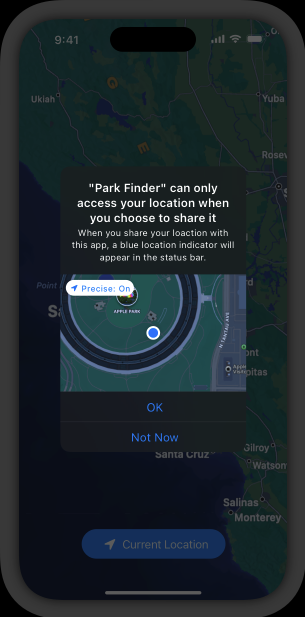

# Location button

In iOS, iPadOS, and watchOS, Core Location provides a button so people can grant your app temporary authorization to access their location at the moment a task needs it. A location button’s appearance can vary to match your app’s UI and it always communicates the action of location sharing in a way that’s instantly recognizable.

The first time people open your app and tap a location button, the system displays a standard alert. The alert helps people understand how using the button limits your app’s access to their location, and reminds them of the location indicator that appears when sharing starts.

After people confirm their understanding of the button’s action, simply tapping the location button gives your app one-time permission to access their location. Although each one-time authorization expires when people stop using your app, they don’t need to reconfirm their understanding of the button’s behavior.

> **Note**
> If your app has no authorization status, tapping the location button has the same effect as when a person chooses Allow Once in the standard alert. If people previously chose While Using the App, tapping the location button doesn’t change your app’s status. For developer guidance, see [LocationButton](https://developer.apple.com/documentation/CoreLocationUI/LocationButton) (SwiftUI) and [CLLocationButton](https://developer.apple.com/documentation/CoreLocationUI/CLLocationButton) (Swift).

Consider using the location button to give people a lightweight way to share their location for specific app features. For example, your app might help people attach their location to a message or post, find a store, or identify a building, plant, or animal they’ve encountered in their location. If you know that people often grant your app Allow Once permission, consider using the location button to help them benefit from sharing their location without having to repeatedly interact with the alert.

- Consider customizing the location button to harmonize with your UI. Specifically, you can:

- Choose the system-provided title that works best with your feature, such as “Current Location” or “Share My Current Location.”

- Choose the filled or outlined location glyph.

- Select a background color and a color for the title and glyph.

- Adjust the button’s corner radius.

To help people recognize and trust location buttons, you can’t customize the button’s other visual attributes. The system also ensures a location button remains legible by warning you about problems like low-contrast color combinations or too much translucency. In addition to fixing such problems, you’re responsible for making sure the text fits in the button — for example, button text needs to fit without truncation at all accessibility text sizes and when translated into other languages.

> **Important**
> If the system identifies consistent problems with your customized location button, it won’t give your app access to the device location when people tap it. Although such a button can perform other app-specific actions, people may lose trust in your app if your location button doesn’t work as they expect.
