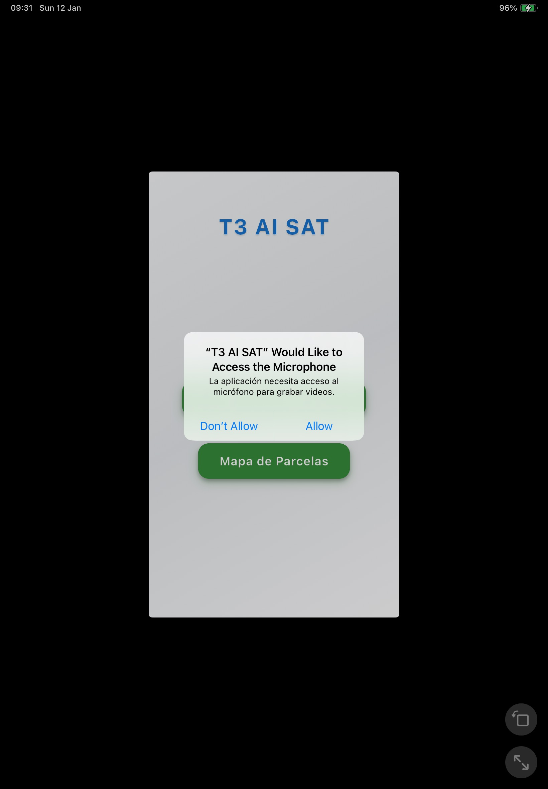
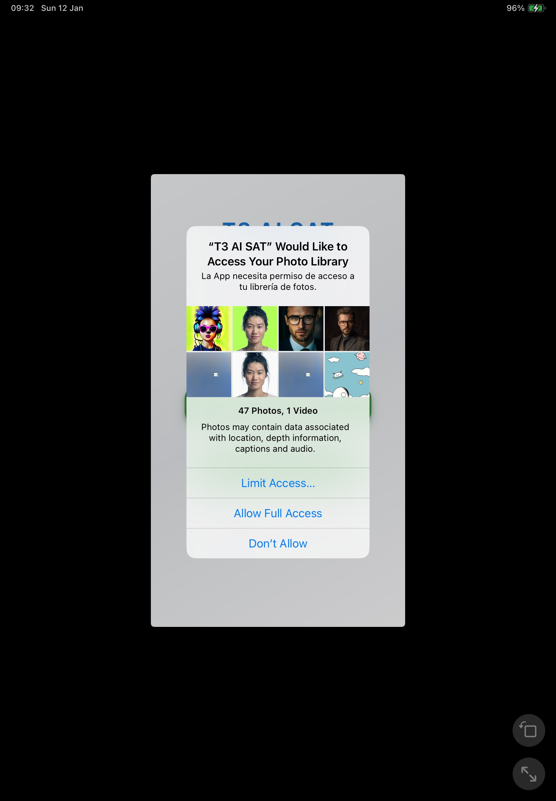

# App rejected version 1.0.7-b3

## Reason for rejection

### Review Environment

Submission ID: 9dcf2f23-df24-48d3-9fcb-0b7f1a1d92df
Review date: January 12, 2025
Version reviewed: 1.0.0

### Guideline 5.1.1 - Legal - Privacy - Data Collection and Storage

#### Issue Description

One or more purpose strings in the app do not sufficiently explain the use of protected resources. Purpose strings must clearly and completely describe the app's use of data and, in most cases, provide an example of how the data will be used.

#### Next Steps

Update the camera, photo library, microphone, and location purpose string to explain how the app will use the requested information and provide a specific example of how the data will be used. See the attached screenshot.

- 
- 
- 

#### Resources

Purpose strings must clearly describe how an app uses the ability, data, or resource. The following are hypothetical examples of unclear purpose strings that would not pass review:

- "App would like to access your Contacts"
- "App needs microphone access"

See examples of [helpful, informative purpose strings](https://developer.apple.com/design/human-interface-guidelines/privacy#Requesting-permission). The information about purpose strings from [Apple's Human Interface Guidelines](https://developer.apple.com/design/human-interface-guidelines/privacy#Requesting-permission) is also available locally in the [Permission Request Guidelines](requesting_permission.md)

#### Support

- Reply to this message in your preferred language if you need assistance. If you need additional support, use the [Contact Us module](https://developer.apple.com/contact/topic/#!/topic/select).
- Consult with fellow developers and Apple engineers on the [Apple Developer Forums](https://developer.apple.com/forums/).
- Request a 30-minute online meeting with an App Review expert to [discuss the guidelines and best practices for a smooth review process](https://developer.apple.com/events/view/upcoming-events?search=review).

- Provide feedback on this message and your review experience by completing a short survey.
