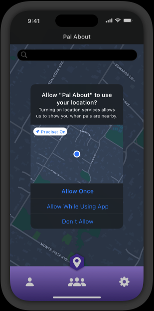
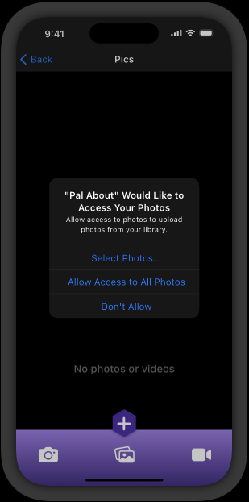
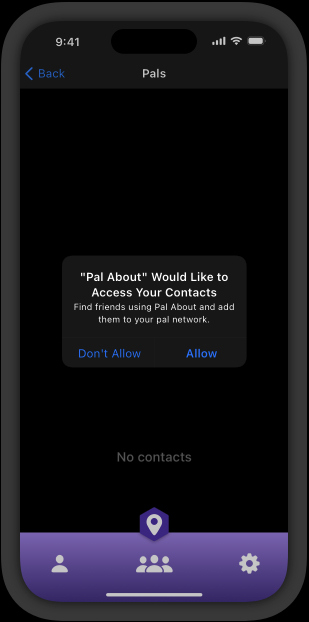

# Requesting permission

Here are several examples of the things you must request permission to access:

- Personal data, including location, health, financial, contact, and other personally identifying information

- User-generated content like emails, messages, calendar data, contacts, gameplay information, Apple Music activity, HomeKit data, and audio, video, and photo content

- Protected resources like Bluetooth peripherals, home automation features, Wi-Fi connections, and local networks

- Device capabilities like camera and microphone

- In a visionOS app running in a Full Space, ARKit data, such as hand tracking, plane estimation, image anchoring, and world tracking

- The device’s advertising identifier, which supports app tracking

The system provides a standard alert that lets people view each request you make. You supply copy that describes why your app needs access, and the system displays your description in the alert. People can also view the description — and update their choice — in Settings > Privacy.

**Request permission only when your app clearly needs access to the data or resource**. It’s natural for people to be suspicious of a request for personal information or access to a device capability, especially if there’s no obvious need for it. Ideally, wait to request permission until people actually use an app feature that requires access. For example, you can use the [location button](https://developer.apple.com/design/human-interface-guidelines/privacy#Location-button) to give people a way to share their location after they indicate interest in a feature that needs that information.

**Avoid requesting permission at launch unless the data or resource is required for your app to function**. People are less likely to be bothered by a launch-time request when it’s obvious why you’re making it. For example, people understand that a navigation app needs access to their location before they can benefit from it. Similarly, before people can play a visionOS game that lets them bounce virtual objects off walls in their surroundings, they need to permit the game to access information about their surroundings.

**Write copy that clearly describes how your app uses the ability, data, or resource you’re requesting**. The standard alert displays your copy (called a purpose string or usage description string) after your app name and before the buttons people use to grant or deny their permission. Aim for a brief, complete sentence that’s straightforward, specific, and easy to understand. Use sentence case, avoid passive voice, and include a period at the end. For developer guidance, see [Requesting access to protected resources](https://developer.apple.com/documentation/UIKit/requesting-access-to-protected-resources) and [App Tracking Transparency](https://developer.apple.com/documentation/AppTrackingTransparency).

|     | Example purpose string                                     | Notes                                                                            |
| --- | ---------------------------------------------------------- | -------------------------------------------------------------------------------- |
| ✅  | The app records during the night to detect snoring sounds. | An active sentence that clearly describes how and why the app collects the data. |
| ❌  | Microphone access is needed for a better experience.       | A passive sentence that provides a vague, undefined justification.               |
| ❌  | Turn on microphone access.                                 | An imperative sentence that doesn't provide any justification.                   |

Here are several examples of the standard system alert:

Example 1

Example 2

Example 3

> **Note**
> The content linked in [Requesting access to protected resources](https://developer.apple.com/documentation/UIKit/requesting-access-to-protected-resources) is also available in this documentation at [requesting_access_protected_resources.md](requesting_access_protected_resources.md).
